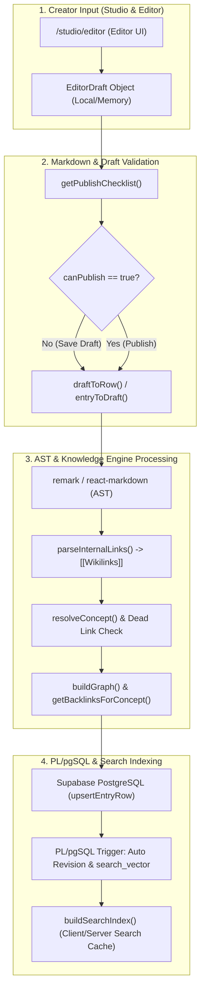

# ARCHRON — Technical Architecture Specification
> **เอกสารสถาปัตยกรรมทางเทคนิคและโครงสร้างระบบคลังความรู้เชิงกราฟ (Knowledge Graph & Wiki Engine)**  
> **ระบบ:** Archron (คลังความรู้ภาษาไทยเรื่องจิตใจมนุษย์เชิงปรัชญาและจิตวิทยา)  
> **สแตกเทคโนโลยีหลัก:** Next.js 16 (App Router) · React 19 · Tailwind CSS v4 · Supabase (PostgreSQL) · Clerk Auth · TypeScript

---

## สารบัญ (Table of Contents)
1. [เมทริกซ์สถาปัตยกรรม 4 ชั้น (4-Tier Architecture Matrix)](#1-เมทริกซ์สถาปัตยกรรม-4-ชั้น-4-tier-architecture-matrix)
2. [ข้อมูลจำเพาะของไปป์ไลน์ความรู้ (Knowledge Pipeline Specification)](#2-ข้อมูลจำเพาะของไปป์ไลน์ความรู้-knowledge-pipeline-specification)
3. [ผังโครงสร้างเทคโนโลยีระดับโปรดักชัน (Production Tech Stack Blueprint)](#3-ผังโครงสร้างเทคโนโลยีระดับโปรดักชัน-production-tech-stack-blueprint)
4. [วงจรการจัดระเบียบโฟลเดอร์ ARCHRON (ARCHRON Folder Organization Loop)](#4-วงจรการจัดระเบียบโฟลเดอร์-archron-archron-folder-organization-loop)
5. [รัฐธรรมนูญโครงสร้างโฟลเดอร์ (Folder Constitution)](#5-รัฐธรรมนูญโครงสร้างโฟลเดอร์-folder-constitution)

---

## 1. เมทริกซ์สถาปัตยกรรม 4 ชั้น (4-Tier Architecture Matrix)

สถาปัตยกรรมของ **Archron** ถูกออกแบบให้เป็นระบบคลังความรู้เชิงความสัมพันธ์ (Relational Knowledge Graph) ที่ทำงานบนสถาปัตยกรรม Full-stack สมัยใหม่ โดยแบ่งหน้าที่การประมวลผลออกเป็น 4 ชั้นหลักอย่างเด็ดขาด (Separation of Concerns) เพื่อให้ระบบรองรับการขยายตัว (Scalability) ประสิทธิภาพการเรนเดอร์ระดับสูง (High Performance & SEO) และความปลอดภัยของข้อมูลผู้เขียน (Data Integrity & Security)

```
+-----------------------------------------------------------------------------------+
|                         1. APPLICATION LAYER (UI & ROUTING)                       |
|   Next.js 16 (App Router)  ·  React 19 (RSC/Client)  ·  Tailwind CSS v4 (@theme)  |
+-----------------------------------------------------------------------------------+
                                         |
                                         v
+-----------------------------------------------------------------------------------+
|                       2. RENDERING ENGINE LAYER (CONTENT)                         |
|        @next/mdx  ·  react-markdown  ·  remark-gfm  ·  Custom AST Transformers    |
+-----------------------------------------------------------------------------------+
                                         |
                                         v
+-----------------------------------------------------------------------------------+
|                      3. KNOWLEDGE ENGINE LAYER (DOMAIN CORE)                      |
|      Domain Core Logic  ·  [[Wikilinks]]  ·  Relationships  ·  Backlinks/Slugs    |
+-----------------------------------------------------------------------------------+
                                         |
                                         v
+-----------------------------------------------------------------------------------+
|                      4. DATABASE LAYER (STORAGE & SECURITY)                       |
|   PostgreSQL (Supabase)  ·  PL/pgSQL Triggers  ·  Clerk Auth Proxy  ·  RLS Guard  |
+-----------------------------------------------------------------------------------+
```

### รายละเอียดโครงสร้างทางเทคนิคของแต่ละชั้น (Tier Deep Dive)

#### 1. ชั้นแอปพลิเคชัน (Application Layer)
* **Next.js 16 (App Router):** ทำหน้าที่เป็นโครงกระดูกหลักของแอปพลิเคชัน (Core Routing & Execution Environment)
  * **Server-First Paradigm:** ใช้ React Server Components (RSC) เป็นค่าเริ่มต้น สำหรับดึงข้อมูลและเรนเดอร์เนื้อหาวิชาการและบทความจากเซิร์ฟเวอร์โดยตรง เพื่อลดภาระ JavaScript Bundle Size บนเครื่องของผู้ใช้ และเพิ่มประสิทธิภาพ SEO สูงสุด
  * **Hybrid Rendering Strategy:** รองรับทั้ง **Static Site Generation (SSG)** และ **Incremental Static Regeneration (ISR)** (`export const revalidate = 300` สำหรับอัปเดตแคชทุก 5 นาทีในหน้า `/articles`, `/concepts`, `/schools`, `/thinkers`) รวมถึง **Dynamic Rendering** ในหน้าที่มีปฏิสัมพันธ์สูง เช่น `/constellation` และ `/studio/*`
* **React 19:** ขับเคลื่อนการจัดการสถานะและคอมโพเนนต์
  * **Concurrent Features & Actions:** ใช้ Server Actions และ Transitions สำหรับจัดการ Form Submission และ Content Mutations ใน `Studio Editor`
  * **Strict Boundary Control:** แยกสัดส่วนระหว่าง Client Components (`'use client'` สำหรับ Interactive components เช่น `searchable-select`, `scroll-reveal`, `accordion`, `constellation-mindmap`) และ Server Components อย่างชัดเจน
* **Tailwind CSS v4:** ระบบจัดการดีไซน์และสไตล์ชีต (Design System & Styling Engine)
  * **CSS-First Configuration (`@theme`):** กำหนด Design Tokens พื้นเมืองไว้ใน `app/globals.css` โดยตรง เช่น พื้นหลัง `--color-bg: #FAF8F5`, พื้นหลังการ์ด `--color-bg-card: #FFFFFF`, สีเน้น (Primary/Academic) `--color-accent: #5F8DCE`, และสีทองพิเศษ `--color-premium: #B89A63`
  * **Modern Typography Tokens:** กำหนดฟอนต์ 5 กลุ่มเพื่อความสวยงามและการอ่านที่สบายตา (`--font-display` Playfair Display, `--font-heading` IBM Plex Serif + Noto Serif Thai, `--font-body` Lora + Noto Serif Thai, `--font-ui` Inter + Noto Sans Thai, และ `--font-wordmark` Cinzel)

#### 2. ชั้นระบบเรนเดอร์และประมวลผลเนื้อหา (Rendering Engine Layer)
* **`@next/mdx` & `react-markdown`:** ทำหน้าที่ประมวลผลและเรนเดอร์เอกสารประเภท Markdown และ MDX ในสองสภาวะแวดล้อม:
  * **Build-time / Static Pages:** ใช้ MDX Engine สำหรับเอกสารเชิงโครงสร้างที่คงที่ เช่น หน้า `/guide` หรือ `/support` (`.mdx`)
  * **Runtime / Dynamic Content:** ใช้ `react-markdown` ร่วมกับ Custom Components Map ในคอมโพเนนต์ `ReadingPage` (`reading/reading-page.tsx`) สำหรับแสดงผลบทความและแนวคิด (`ContentEntry`) ที่ดึงจากระบบฐานข้อมูลและไฟล์ Seed
* **`remark-gfm` & Custom AST Transformers:** 
  * ปลั๊กอิน `remark-gfm` เปิดใช้งานคุณสมบัติ GitHub Flavored Markdown (ตาราง, ขีดฆ่า, รายการตรวจสอบ)
  * **Custom AST Transformers:** ทำหน้าที่เดินสกัดโหนด (Abstract Syntax Tree Traversing) เพื่อตรวจจับลวดลายไวยากรณ์พิเศษของ Archron เช่น ลิงก์ภายในแบบ Obsidian (`[[slug]]` หรือ `[[slug|Display Label]]`) แปลงให้เป็น React Component ปลายทาง `<InternalLinkText />` พร้อมฝังคุณสมบัติ Tooltip และ Link Routing

#### 3. ชั้นแกนกลางความรู้และตรรกะโดเมน (Knowledge Engine Layer)
* **Domain Core Logic:** บริหารจัดการองค์ความรู้ใน 15 โหนดหลักของคลังความรู้ (`concept-registry.ts`) และการเชื่อมโยงข้อมูลหลายมิติ (Entry Mapper & Draft Mapper)
* **Wikilinks & Internal Link Resolution:** 
  * โมดูล `internal-links.ts` ทำหน้าที่ถอดรหัสข้อความที่มี `[[wikilink]]` และตรวจสอบว่าเป้าหมาย (Slug) มีตัวตนจริงในระบบหรือไม่ (`findDeadLinks`) หรือเป็นเพียง Draft/Missing Node
  * **Link Suggestion Engine:** ระบบแนะนำความสัมพันธ์ลิงก์ภายในสำหรับ Studio (`findLinkSuggestions` และ `internal-link-suggestion-panel.tsx`)
* **Relationships & Backlinks Engine (`related.ts` & `graph.ts`):**
  * คำนวณความสัมพันธ์แบบสองทิศทาง (Bidirectional Linking) เมื่อบทความ ก อ้างถึง แนวคิด ข (`[[concept-b]]`) ระบบจะคำนวณและสร้าง **Backlinks** (`getBacklinksForConcept`) เพื่อแสดงผลในส่วน "อ้างอิงถึงแนวคิดนี้" ของแนวคิด ข อัตโนมัติ
  * จัดการประเภทความสัมพันธ์ (`RelationType`): `parent`, `child`, `related`, `contrast`, `prerequisite` สำหรับวาดเส้นโครงข่ายใน Constellation Mindmap
* **Slugs & Publication Validation:**
  * โมดูล `publish-validation.ts` ตรวจสอบความครบถ้วนของข้อมูลก่อนเผยแพร่ (`getPublishChecklist()`, `canPublish()`) และแปลงชื่อหัวข้อเป็น URL Slug มาตรฐาน (`slugify()`)

#### 4. ชั้นฐานข้อมูลและความปลอดภัย (Database Layer)
* **PostgreSQL (Supabase Platform):** เก็บข้อมูลตารางหลัก (`entries` สำหรับบทความและแนวคิด, `entry_revisions` สำหรับจัดเก็บประวัติและเวอร์ชันทุกครั้งที่มีการแก้ไข)
* **PL/pgSQL Triggers & Functions:**
  * **Auto-Timestamp Trigger:** อัปเดต `updated_at` อัตโนมัติเมื่อมีการแก้ไขแถวข้อมูลใน `entries`
  * **Full-Text Search Indexing:** สร้างและอัปเดตเวกเตอร์การค้นหา (`search_vector`) อัตโนมัติในฐานข้อมูล รองรับการค้นหาคำไทยและอังกฤษอย่างรวดเร็ว
  * **Atomic Revision Snapshot:** ฟังก์ชันและทริกเกอร์บันทึกประวัติข้อความเดิมลงใน `entry_revisions` ก่อนทำการ `UPDATE` เพื่อรับประกันว่าประวัติการแก้ไข (Revisions) จะไม่สูญหายและสามารถกู้คืนได้ผ่าน `RevisionPanel`
* **Clerk Authentication & Proxy Shield:**
  * ยืนยันตัวตนผู้ใช้งานและนักเขียนผ่าน **Clerk** โดยมีไฟล์ `proxy.ts` ทำหน้าที่เป็น Edge Guard ป้องกันเส้นทาง `/studio(.*)` หากผู้ใช้ไม่มีสิทธิ์หรือไม่มี Token ที่ถูกต้อง จะถูกสกัดกั้นทันทีก่อนถึงชั้นแอปพลิเคชัน
* **Row-Level Security (RLS) Policies:**
  * **Public Read Policy:** อนุญาตให้สาธารณชน (Anonymous user) ดึงข้อมูลจากตาราง `entries` ได้เฉพาะรายการที่ `status = 'published'` เท่านั้น (`getPublicEntries()`)
  * **Editor / Creator Mutation Policy:** อนุญาตให้ผู้ใช้ที่ผ่านการยืนยันตัวตน (Authenticated with Clerk Token) สามารถทำการ `SELECT`, `INSERT`, `UPDATE`, และ `DELETE` เฉพาะร่างบทความ (`draft`) และบทความที่ตนเองเป็นเจ้าของ (หรือมีสิทธิ์ระดับ Editor) ผ่านฟังก์ชัน `upsertEntryRow()` และ `deleteEntry()`

---

## 2. ข้อมูลจำเพาะของไปป์ไลน์ความรู้ (Knowledge Pipeline Specification)

ไปป์ไลน์ความรู้ของ Archron คือกระบวนการส่งต่อ เปลี่ยนรูป และตรวจสอบข้อความตั้งแต่ปลายนิ้วของผู้สร้างเนื้อหาใน Studio ไปจนถึงการจัดเก็บลงฐานข้อมูลและดัชนีค้นหาเชิงความสัมพันธ์อย่างสมบูรณ์



### ขั้นตอนการประมวลผลในไปป์ไลน์ (Detailed Pipeline Steps)

#### ขั้นตอนที่ 1: การป้อนข้อมูลโดยผู้สร้างเนื้อหา (Creator Input - Studio & Editor)
1. ผู้เขียนเข้าสู่หน้า `/studio/editor` (ผ่านการตรวจสอบสิทธิ์ Clerk Auth ใน `proxy.ts` และ `app/studio/layout.tsx`)
2. กรอกข้อมูลและเขียนเนื้อหาด้วยรูปแบบ Markdown / MDX ลงในฟอร์ม Interactive
3. สภาวะแวดล้อมจำลองโครงสร้างข้อมูลเป็นออบเจกต์ `EditorDraft` (`types/content.ts`) ซึ่งประกอบด้วยชื่อหัวข้อ (`title`), สลัก (`slug`), บทคัดย่อ (`summary`), เนื้อหา (`content`), หมวดหมู่ (`type`), แนวคิดที่เกี่ยวข้อง (`relatedConcepts`), และแหล่งอ้างอิง (`sources`)

#### ขั้นตอนที่ 2: การจัดรูปแบบและตรวจสอบความพร้อมก่อนเผยแพร่ (Markdown & Draft Validation)
1. เมื่อผู้เขียนคลิกบันทึกหรือเตรียมเผยแพร่ ระบบจะเรียกโมดูล `publish-validation.ts`
2. **Publish Checklist Verification:** ฟังก์ชัน `getPublishChecklist(draft)` ตรวจสอบเกณฑ์มาตรฐาน 5 ข้อ:
   * มีหัวข้อ (`title`) และสลัก (`slug`) ที่ถูกต้องตามรูปแบบ `slugify()`
   * เนื้อหาหลัก (`content`) มีความยาวเพียงพอตามเกณฑ์ขั้นต่ำของประเภทเนื้อหา
   * มีคำอธิบายสรุป (`summary`) สำหรับแสดงในการ์ดตัวอย่างและ SEO
   * ตรวจสอบความสมบูรณ์ของแนวคิดที่เกี่ยวข้อง (`relatedConcepts`) ว่ามีการเลือก `relationType` ครบถ้วน
   * หากเลือกเผยแพร่เป็นบทความวิชาการ ต้องมีแหล่งอ้างอิง (`sources`) อย่างน้อย 1 รายการ
3. หาก `canPublish(draft)` คืนค่า `true` ผู้เขียนสามารถเปลี่ยนสถานะเป็น `ArticleStatus.PUBLISHED` ได้ หากไม่ผ่าน ระบบจะอนุญาตให้บันทึกเป็นเพียง `ArticleStatus.DRAFT`

#### ขั้นตอนที่ 3: การวิเคราะห์และแปลงโครงสร้างไวยากรณ์ (AST Transformation Pipeline)
1. เมื่อเนื้อหาถูกนำไปเรนเดอร์หรือตรวจสอบความเชื่อมโยง โมดูล `internal-links.ts` จะเข้าสแกนข้อความด้วย regex และ AST tree parser
2. **Wikilink Extraction:** ฟังก์ชัน `parseInternalLinks(content)` ดึงรูปแบบ `[[target-slug]]` หรือ `[[target-slug|ข้อความแสดงผล]]` ทั้งหมดออกจากข้อความ
3. **Dead Link & Target Resolution:** นำรายการ Slug ที่สกัดได้ไปตรวจสอบกับ `Concept Registry` (`concept-registry.ts`) และรายชื่อบทความในฐานข้อมูลผ่าน `findDeadLinks()`
   * หาก Slug ปลายทางมีอยู่จริง: เรนเดอร์เป็น Component `<InternalLinkText />` พร้อมลิงก์ไปยังหน้านั้น และแสดงข้อความอธิบายย่อ (Tooltip) เมื่อผู้ใช้เอาเมาส์ชี้
   * หาก Slug ปลายทางไม่มีอยู่จริง (Dead Link): เรนเดอร์ด้วยสไตล์เส้นประสีแดงเตือนผู้เขียนใน Studio เพื่อให้ทราบว่าต้องสร้างโหนดดังกล่าวเพิ่มเติมในอนาคต

#### ขั้นตอนที่ 4: การประมวลผลเชิงความสัมพันธ์ (Knowledge Engine Processing)
1. ระบบเชื่อมโยงข้อมูลความสัมพันธ์ไป-กลับ (`related.ts`)
2. เมื่อโหนดหรือบทความใหม่ถูกอัปเดต กลไก `getBacklinksForConcept(conceptSlug, allEntries)` จะสแกนค้นหาบทความทุกชิ้นที่อ้างถึง `[[conceptSlug]]` เพื่อรวบรวมเป็นรายการ **"อ้างอิงถึงแนวคิดนี้ (Backlinks)"**
3. กลไก `buildGraph()` (`graph.ts`) อัปเดตโครงข่ายระบุประเภทโหนด (`NODE_TYPE_LABEL/COLOR`) และประเภทความสัมพันธ์ (`RELATION_LABEL`) เพื่อเตรียมพร้อมสำหรับการแสดงผลในแผนที่จักรวาลปัญญา `/constellation`

#### ขั้นตอนที่ 5: การจัดเก็บลงฐานข้อมูลและดัชนีค้นหา (PL/pgSQL Storage & Search Indexing)
1. ฟังก์ชัน `upsertEntryRow()` (`entries-db.ts`) ส่งข้อมูลที่แปลงผ่าน `draftToRow()` เข้าสู่ฐานข้อมูล Supabase PostgreSQL
2. **PL/pgSQL Triggers execution (At DB Level):**
   * **`log_entry_revision_trigger`:** ทำงานก่อน `UPDATE` เพื่อคัดลอกข้อมูลเก่าเก็บลงตาราง `entry_revisions` พร้อมบันทึก `editor_id` และ `commit_message`
   * **`update_entry_search_vector_trigger`:** คำนวณค่า `to_tsvector('simple', coalesce(title,'') || ' ' || coalesce(summary,'') || ' ' || coalesce(content,''))` เก็บลงคอลัมน์ `search_vector` สำหรับ Full-text search
3. **Cache Revalidation & Search Index Update:**
   * ระบบแจ้งเตือน Next.js ให้ทำการล้างแคชเส้นทางที่เกี่ยวข้อง (Revalidate Path/Tag)
   * ฟังก์ชัน `buildSearchIndex()` (`search-index.ts`) รีเฟรชดัชนีค้นหากลาง เพื่อให้หน้า `/search` สามารถดึงข้อมูลที่อัปเดตใหม่ได้ทันที

---

## 3. ผังโครงสร้างเทคโนโลยีระดับโปรดักชัน (Production Tech Stack Blueprint)

โครงสร้างเทคโนโลยีของ Archron ถูกสร้างขึ้นบนมาตรฐานการพัฒนาซอฟต์แวร์ระดับสูง (Engineering Excellence) โดยแบ่งการทำงานออกเป็น 3 แกนหลักอย่างเป็นระบบ:

```
+-----------------------------------------------------------------------------------+
|                        FRONTEND & VISUALIZATION BLUEPRINT                         |
|                                                                                   |
|  [Next.js App Router] <---> [React 19 Components] <---> [Tailwind v4 Design System]|
|          |                         |                              |               |
|          v                         v                              v               |
|   Static/ISR Route Pages    Interactive Client UI      CSS-First Tokens (@theme)  |
|   (/articles, /concepts)    (Search, Accordion, Modal)  (--color-*, --font-*)     |
|          |                         |                                              |
|          +-------------------------+----------------------------------------------+
|                                    |                                              |
|                                    v                                              |
|               [Constellation Mindmap Engine (SVG + Physics Math)]                 |
+-----------------------------------------------------------------------------------+
                                     ^
                                     |  JSON / API / Server Actions / Props
                                     v
+-----------------------------------------------------------------------------------+
|                       BACKEND & DATABASE LOGIC BLUEPRINT                          |
|                                                                                   |
|  [Clerk Security Proxy] <-> [Supabase Client/Server] <-> [PostgreSQL 16 DB Layer] |
|          |                         |                              |               |
|          v                         v                              v               |
|   Edge Route Shield         RLS Policy Enforcement     PL/pgSQL Triggers & Vectors|
|   (/studio/* Guard)         (Public Read vs Auth Write) (Revisions, updated_at)   |
+-----------------------------------------------------------------------------------+
                                     ^
                                     |  Raw Markdown / Draft / Row Entities
                                     v
+-----------------------------------------------------------------------------------+
|                     CONTENT RENDERING PROCESSING BLUEPRINT                        |
|                                                                                   |
|  [Markdown/MDX Parser] <--> [AST Wikilink Transformer] <-> [Knowledge Graph Engine]|
|          |                         |                              |               |
|          v                         v                              v               |
|   remark-gfm / @next/mdx    parseInternalLinks()       buildGraph() & Backlinks   |
|   Table/Callout/Seals       [[Slug|Label]] -> React     Concept Registry Index    |
+-----------------------------------------------------------------------------------+
```

### 3.1 Frontend & Visualization (ส่วนติดต่อผู้ใช้และการแสดงผลข้อมูลเชิงกราฟ)
* **Framework & Core Runtime:** Next.js 16 (App Router) และ React 19 ใช้ TypeScript (`strict: true`) ตลอดทั้งโครงการ
* **UI Structure & Layout Chrome (`app/layout.tsx`):**
  * **Global Layout Elements:** `SiteHeader` (Sticky Glass-nav, Dropdown Menu, QuickOpen, Mobile Menu), `SiteFooter` (3-Column Layout, Newsletter), `SkipToContent` (Accessibility for screen readers), `ScrollReveal` (IntersectionObserver ปลดล็อก UI animations) และ `ScrollToTop`
* **Interactive Visualization (`components/constellation/constellation-mindmap.tsx`):**
  * คอมโพเนนต์แสดงผลแผนที่จักรวาลความรู้เชิงกัมมันตภาพ (Radial Focus-Map)
  * **SVG Mathematical Path Generation:** คำนวณจุดพิกัดเรขาคณิต (Trigonometric Coordinates) วาดเส้นตรงและเส้นโค้ง Bezier เชื่อมโยงระหว่างโหนดศูนย์กลางและโหนดเครือข่าย
  * **Dynamic Node Chips:** เรนเดอร์ HTML/React Chips เหนือชั้น SVG รองรับการคลิกเพื่อ Re-center เปลี่ยนโฟกัส พร้อมสีสันและไอคอนตามประเภทโหนด (`NODE_TYPE_COLOR`)
  * **No-JS Fallback:** รองรับการทำงานแบบ Graceful Degradation สำหรับเบราว์เซอร์ที่ปิด JavaScript หรือ Search Engine Bots ให้สามารถอ่านรายการความสัมพันธ์แบบ HTML List ได้ครบถ้วน
* **Design Tokens & Motion System (`app/globals.css`):**
  * ใช้คุณสมบัติ CSS Variables ร่วมกับ Tailwind v4 กำหนดโทนสีเอกลักษณ์:
    * `--color-bg: #FAF8F5` (สีขาวงาช้าง สบายตา สไตล์หนังสือวิชาการ)
    * `--color-text-heading: #1A1815` และ `--color-text-body: #3A3835`
    * `--color-accent: #5F8DCE` (สีฟ้าวิชาการ Archron Blue)
    * `--color-premium: #B89A63` (สีทองสำหรับองค์ประกอบพิเศษหรือ Academic Seals ระดับสูง)
  * กำหนด Motion Constants: `--ease-soft: cubic-bezier(0.16, 1, 0.3, 1)`, `--dur-fast: 150ms`, `--dur-base: 300ms` เพื่อการขยับ UI ที่นุ่มนวล ไม่กระตุก

### 3.2 Backend & Database Logic (ตรรกะระบบเบื้องหลังและจัดการฐานข้อมูล)
* **Database Engine & Schema:** PostgreSQL บนแพลตฟอร์ม Supabase จัดเก็บข้อมูล 2 ตารางหลัก:
  * **`entries`:** เก็บ `id`, `slug`, `title`, `summary`, `content`, `status` (`draft` | `published`), `type`, `author_id`, `created_at`, `updated_at`, `published_at`, และ `search_vector`
  * **`entry_revisions`:** เก็บประวัติการแก้ไขทุกเวอร์ชัน (`entry_id`, `commit_message`, `content_snapshot`, `created_at`)
* **Security & Authentication Flow:**
  * **Clerk Identity Provider:** จัดการเซสชันและโทเค็น JWT ของผู้ใช้
  * **Supabase Clerk Integration:** โอนถ่าย Clerk JWT เข้าสู่ Supabase Client (`lib/supabase/client.ts`) เพื่อให้ PostgreSQL สามารถอ่านค่า `auth.jwt() ->> 'sub'` และ `app_metadata ->> 'role'` ในการตรวจสอบ RLS
  * **Proxy Guard (`proxy.ts`):** ป้องกันไม่ให้บุคคลภายนอกเข้าสู่พื้นที่สตูดิโอ (`/studio/*`) ในระดับ Edge
* **Data Fetching & Caching Strategy:**
  * **Server-Side Public Read (`lib/supabase/server.ts` & `public-source.ts`):** ดึงข้อมูลสำหรับหน้าสาธารณะด้วย Anonymous Key โดยมี Fallback ไปยัง Seed Data (`entries.ts`) ในกรณีที่ฐานข้อมูลกำลังอัปเดตหรืออยู่ในโหมดออฟไลน์
  * **ISR Revalidation:** หน้าแสดงรายการและหน้าอ่าน (`/articles`, `/concepts`, `/schools`) ใช้ `revalidate = 300` เพื่อให้ระบบอัปเดตหน้าเว็บใหม่ทุก 5 นาทีโดยไม่ต้อง Build ใหม่ทั้งหมด

### 3.3 Content Rendering Processing (ระบบประมวลผลและเรนเดอร์เนื้อหา)
* **Hybrid Rendering Engine (`reading/reading-page.tsx`):**
  * คอมโพเนนต์กลาง `ReadingPage` ทำหน้าที่รับผิดชอบเรนเดอร์เนื้อหาทั้งจากหน้า `/articles/[slug]` และ `/concepts/[slug]` เพื่อสร้างประสบการณ์การอ่านแบบ Unified Experience
* **Link Syntax Processing (`reading/internal-link-text.tsx` & `lib/content/internal-links.ts`):**
  * แปลงข้อความและ Markdown ดิบผ่าน Parser สกัดและเช็คเงื่อนไข `[[wikilink]]` โดยเช็คจาก 3 แหล่ง: `concept-registry.ts`, `entries` ในฐานข้อมูล, และ `allEntrySlugs`
  * แสดงผลลิงก์ที่ใช้งานได้พร้อม Tooltip บัตรสรุปย่อ และแสดงสีเตือนสำหรับ Dead Links
* **Academic Seals System (`lib/content/seals.ts` & `components/seals/*`):**
  * ระบบตราเกียรติยศวิชาการ (15 ตรา, 4 ระดับ: Bronze, Silver, Gold, Platinum) คำนวณเงื่อนไขความสำเร็จจากประวัติการอ่านและเขียนในคลังความรู้ แสดงผลด้วย Custom SVG Shapes (`seal-icon.tsx`)

---

## 4. วงจรการจัดระเบียบโฟลเดอร์ ARCHRON (ARCHRON Folder Organization Loop)

เพื่อรักษาให้โครงสร้างโค้ดของ Archron มีความบริสุทธิ์ เป็นระเบียบ ไม่เกิดหนี้สินทางสถาปัตยกรรม (Architectural Debt) และไม่เกิดการสะสมของโค้ดไร้ระเบียบ (Code Entropy) ตลอดอายุขัยของโครงการ ทุกครั้งที่มีการพัฒนาฟีเจอร์ใหม่ การรีแฟกเตอร์ หรือการทำ Code Review นักพัฒนาและ AI Agent **ต้องปฏิบัติตามวงจร 7 ขั้นตอน (The 7-Step Folder Organization Loop)** อย่างเคร่งครัด:

```
    +---------------------------------------------------------------+
    |                         STEP 1: SCAN                          |
    |          (สแกนโครงสร้างและตรวจจับโค้ดผิดตำแหน่ง/สะเปะสะปะ)           |
    +---------------------------------------------------------------+
                                    |
                                    v
    +---------------------------------------------------------------+
    |                       STEP 2: IDENTIFY                        |
    |          (ระบุตัวตนบทบาท: Page Route / UI / Logic / Type)        |
    +---------------------------------------------------------------+
                                    |
                                    v
    +---------------------------------------------------------------+
    |                       STEP 3: ALLOCATE                        |
    |     (จัดสรรที่อยู่ตามรัฐธรรมนูญ: One Feature = One Home)          |
    +---------------------------------------------------------------+
                                    |
                                    v
    +---------------------------------------------------------------+
    |                  STEP 4: MIGRATE & REFACTOR                   |
    |       (ย้ายตำแหน่ง ปรับชื่อ kebab-case และแยกความรับผิดชอบ)         |
    +---------------------------------------------------------------+
                                    |
                                    v
    +---------------------------------------------------------------+
    |                   STEP 5: RE-WIRE & CLEAN                     |
    |      (เชื่อมโยง Import Paths ใหม่ ขจัด Dead Code และ Loop)       |
    +---------------------------------------------------------------+
                                    |
                                    v
    +---------------------------------------------------------------+
    |                        STEP 6: VERIFY                         |
    |      (รัน Build & Lint ต้องเขียว 100% ตรวจสอบ Route/RLS)        |
    +---------------------------------------------------------------+
                                    |
                                    v
    +---------------------------------------------------------------+
    |                        STEP 7: REPEAT                         |
    |    (วนซ้ำเพื่อธำรงรักษาสถาปัตยกรรมให้คงความสง่างามอย่างยั่งยืน)        |
    +---------------------------------------------------------------+
```

### คำอธิบายการปฏิบัติงานในแต่ละขั้นตอนของวงจร (Loop Execution Steps)

#### STEP 1: Scan (สแกนโครงสร้างและวิเคราะห์ขอบเขต)
* ตรวจสอบไฟล์ในพื้นที่ทำงาน (`app/`, `components/`, `lib/`, `types/`) ว่ามีไฟล์ใดที่สร้างขึ้นมาอย่างเฉพาะกิจแล้ววางทิ้งไว้ผิดที่หรือไม่
* ค้นหาไฟล์ที่มีขนาดยักษ์ (Monster Files > 300 บรรทัด) หรือไฟล์ที่รวมหน้าที่ทั้งการดึงข้อมูลฐานข้อมูล การประมวลผลลอจิก และการแสดงผล UI เข้าไว้ด้วยกัน

#### STEP 2: Identify (ระบุตัวตนและจับคู่คุณลักษณะ)
* จำแนกประเภทและบทบาทของโค้ดเป้าหมายออกเป็นกลุ่มตามขอบเขตความรับผิดชอบ:
  * **Route Page Layer:** หน้าจอที่รับผิดชอบเรื่อง URL, Loader, Metadata (`app/**/*.tsx`)
  * **Reusable UI Component:** ชิ้นส่วน UI พื้นฐานหรือชิ้นส่วนนำเสนอที่ไม่ผูกติดกับลอจิกเซิร์ฟเวอร์ (`components/**/*.tsx`)
  * **Domain Logic & Utility:** ลอจิกการคำนวณไวยากรณ์, การแปลงข้อมูล, หรือการดึงข้อมูล DB (`lib/**/*.ts`)
  * **Type Definitions:** นิยาม Interface, Types, Enums (`types/**/*.ts`)
  * **Feature Module:** ฟีเจอร์เฉพาะที่มีองค์ประกอบครบทั้ง UI, Logic, และ State (`features/<feature-name>/*`)

#### STEP 3: Allocate (จัดสรรและสร้างบ้านให้คุณสมบัติ)
* ใช้กฎ **"One Feature = One Home"** และกฎของรัฐธรรมนูญโฟลเดอร์ในการจัดสรรเป้าหมาย:
  * หากเป็นชิ้นส่วนเฉพาะของ Studio Editor ให้กำหนดเป้าหมายไปที่ `components/studio/` หรือ `features/editor/`
  * หากเป็นลอจิกคำนวณและประมวลผลเนื้อหา ให้กำหนดเป้าหมายไปที่ `lib/content/` หรือ `features/knowledge/`
  * **ห้ามวางไฟล์โค้ดของโปรเจกต์ลงในโฟลเดอร์ชั่วคราว (`tmp/`, `.gemini/`) หรือ Root Directory เด็ดขาด**

#### STEP 4: Migrate & Refactor (ย้ายตำแหน่งและปรับโครงสร้างโค้ด)
* ทำการย้ายไฟล์ไปยังบ้านเป้าหมายที่จัดสรรไว้ใน STEP 3
* ปรับชื่อไฟล์ให้ปฏิบัติตามมาตรฐาน `kebab-case.tsx` หรือ `kebab-case.ts` เสมอ (เช่น `internal-link-text.tsx`, `concept-registry.ts`)
* หากไฟล์หนึ่งควบรวมความรับผิดชอบหลายอย่าง ให้ทำการแตกไฟล์ (Split File Refactoring) ตามหลัก **"One File = One Responsibility"**

#### STEP 5: Re-wire & Clean (เชื่อมต่ออ้างอิงและทำความสะอาด)
* อัปเดต Import paths ทั้งหมดใน codebase ให้ชี้ไปยังตำแหน่งใหม่ที่ถูกต้อง โดยใช้ Path Aliases ของโครงการ (`@/components/...`, `@/lib/...`, `@/types/...`)
* ลบ Imports ที่ไม่ได้ใช้งาน (Unused imports), ลบตัวแปรที่ถูกทิ้งร้าง (Dead variables), และตรวจสอบไม่ให้เกิด Circular Dependency (การ Import วนลูประหว่างไฟล์)

#### STEP 6: Verify (ตรวจสอบความถูกต้องตามมาตรฐาน Guardrails)
* รันการตรวจสอบแบบเข้มข้นที่ระบบ Terminal:
  ```bash
  npm run build    # ต้องผ่านโดยไม่มี Error (ตรวจสอบ Static/Dynamic Route Resolution)
  npm run lint     # ต้องเขียว 100% ตามมาตรฐาน ESLint Flat Config (core-web-vitals)
  ```
* ตรวจสอบความสมบูรณ์ของระบบ Routing ของ Next.js, ตรวจสอบว่าระบบ Authentication ของ Clerk ยังทำงานถูกต้อง, และสิทธิ์ RLS ของ Supabase ไม่ถูกกระทบ

#### STEP 7: Repeat (วนซ้ำเพื่อรักษาความบริสุทธิ์ของสถาปัตยกรรม)
* ปิดท้ายรอบงานด้วยการยืนยันว่าโครงสร้างไฟล์สะอาดสะอ้านตามหลักการ
* นำวงจรนี้กลับมาใช้ใหม่ในทุกๆ ครั้งก่อนการ Commit โค้ดลงสู่สาขาหลัก (`main`) เพื่อคงสภาพแวดล้อมการทำงานของทีมและ AI ให้มีประสิทธิภาพสูงสุดตลอดเวลา

---

## 5. รัฐธรรมนูญโครงสร้างโฟลเดอร์ (Folder Constitution)

เพื่อป้องกันความสับสนและรักษาระเบียบวินัยขั้นสูงสุดในการพัฒนา codebase ของ Archron โครงสร้างโฟลเดอร์และไฟล์ทั้งหมดถูกควบคุมด้วย **"รัฐธรรมนูญโครงสร้างโฟลเดอร์ (Folder Constitution)"** ซึ่งกำหนดกฎเหล็กและแผนที่รับผิดชอบของทุกไดเรกทอรีไว้อย่างชัดเจนตายตัว

### 5.1 บัญญัติสูงสุดแห่งรัฐธรรมนูญ (The Constitutional Commandments)

#### 1. One Folder = One Purpose (หนึ่งโฟลเดอร์ = หนึ่งวัตถุประสงค์เดียว)
* **กฎเกณฑ์:** โฟลเดอร์แต่ละโฟลเดอร์ใน codebase ต้องมีวัตถุประสงค์ทางสถาปัตยกรรมเพียงหนึ่งเดียวเท่านั้น
* **ข้อห้าม:** ห้ามผสมไฟล์ UI Component ทั่วไป (`components/`), ไฟล์ Server Database Queries (`lib/supabase/`), และไฟล์รากฐาน Route (`app/`) เข้าด้วยกันในโฟลเดอร์เดียวกันโดยเด็ดขาด

#### 2. One Feature = One Home (หนึ่งคุณสมบัติ = หนึ่งบ้านเกิด)
* **กฎเกณฑ์:** เมื่อพัฒนาคุณสมบัติหรือระบบย่อยใดๆ (เช่น ระบบ Constellation Mindmap หรือ ระบบ Revision History) ส่วนประกอบที่เป็นแกนหลักร่วมกันของระบบนั้นจะต้องมีที่อยู่ร่วมกันเป็นหมวดหมู่ (Grouped Hubs หรือ `features/*`)
* **ข้อห้าม:** ห้ามสร้างคอมโพเนนต์ของระบบเดียวแยกกระจัดกระจายโดยไม่มีโครงสร้างไดเรกทอรีคอยจัดกลุ่ม

#### 3. One File = One Responsibility (หนึ่งไฟล์ = หนึ่งความรับผิดชอบเดียว)
* **กฎเกณฑ์:** แต่ละไฟล์ต้องมีหน้าที่หลักเพียงประการเดียวตามหลัก Single Responsibility Principle (SRP)
  * ถ้าเป็นคอมโพเนนต์แสดงผลปุ่มหรือ Modal ก็จงรับผิดชอบเฉพาะ UI และ Client Interaction (`'use client'`)
  * ถ้าเป็นไฟล์เชื่อมโยง Supabase Database (`entries-db.ts`) ก็จงรับผิดชอบเฉพาะ Data Queries และ Mutations
* **ข้อห้าม:** ห้ามเขียน Client Component ที่มีทั้ง Interactive UI, Raw SQL/RLS Logic, และ Markdown Processing รวมอยู่ในไฟล์เดียวตั้งแต่ 500 บรรทัดขึ้นไป

#### 4. Build nothing until everything has a home (ห้ามสร้างสิ่งใดจนกว่าทุกสิ่งจะมีที่อยู่)
* **กฎเกณฑ์:** ก่อนการเริ่มต้นเขียนโค้ดฟีเจอร์หรือคอมโพเนนต์ใหม่ทุกชิ้น นักพัฒนาและ AI Agent ต้องระบุตำแหน่งบ้านเป้าหมายของไฟล์ในแผนที่รัฐธรรมนูญนี้ให้แน่ชัดเสียก่อน
* **ข้อห้าม:** ห้ามเริ่มเขียนไฟล์โค้ดลอยๆ ใน root directory หรือชั่วคราวแล้วค่อยคิดหาที่อยู่ทีหลัง

---

### 5.2 แผนที่สถาปัตยกรรมโฟลเดอร์โดยละเอียด (Detailed Folder Architecture Map)

ด้านล่างนี้คือแผนที่แสดงบทบาทและความรับผิดชอบของทุกโฟลเดอร์สำคัญในโครงการ Archron ซึ่งทำหน้าที่เป็นมาตรฐานความจริงเพียงหนึ่งเดียว (Single Source of Truth):

```
Archron/ (Root Directory Matrix)
├── app/                  -> [Application Route Matrix] โครงสร้างหน้าและ Routing ทั้งหมดของ Next.js App Router
├── components/           -> [Core & Domain UI Hubs] ชิ้นส่วน UI นำเสนอและคอมโพเนนต์ตามหมวดหมู่
├── lib/                  -> [Knowledge Engine & Backend Utilities] แกนกลางลอจิก, ฐานข้อมูล, และคำสั่งสนับสนุน
├── types/                -> [Type System & Domain Contracts] นิยามโครงสร้างข้อมูลและ TypeScript Interfaces
└── features/ (หรือ Logical Feature Hubs ในระดับระบบ)
    ├── entities/         -> [Entities Feature Module] โดเมนหน่วยย่อยความรู้ (Thinkers, Schools, Concepts)
    ├── knowledge/        -> [Knowledge Traversal Module] ลอจิกท่องเครือข่ายความรู้, การเชื่อมโยง, และดัชนี
    ├── renderer/         -> [Content Renderer Module] ระบบเรนเดอร์ MDX/Markdown และ Custom AST Transformers
    ├── studio/           -> [Studio Tools Module] คอมโพเนนต์และส่วนเสริมสำหรับสตูดิโอผู้เขียน
    ├── editor/           -> [Content Editor Module] ตัวเขียนและแก้ไขเนื้อหา Interactive และ Draft state
    ├── database/         -> [Database Schema Module] โครงสร้าง SQL, RLS Policies, และ Migrations
    └── server/           -> [Server Actions & Proxy Module] ลอจิกฝั่งเซิร์ฟเวอร์, API Guard, และ Proxy Shield
```

#### การจัดจำแนกหน้าที่รายโฟลเดอร์ (Comprehensive Folder Mapping)

##### 1. โฟลเดอร์ `src/app/` (หรือ `app/` App Router Matrix)
* **วัตถุประสงค์ (One Purpose):** จัดการระบบ URL Routing, Static/Dynamic Page Layouts, Page Metadata, และ Global App Chrome
* **โครงสร้างภายในที่สำคัญ:**
  * `app/layout.tsx`: โครงสร้างหลัก (Root Layout) ฝังฟอนต์ 5 กลุ่ม, `SiteHeader`, `SiteFooter`, และ Provider ต่างๆ
  * `app/template.tsx`: ตัวจัดการ Page transitions และ IntersectionObserver `ScrollReveal`
  * `app/page.tsx`: หน้าแรกของโครงการ (Hero, Search, Featured Guide, Latest Knowledge)
  * `app/articles/`, `app/books/`, `app/concepts/`, `app/schools/`, `app/thinkers/`, `app/themes/`, `app/reading-sets/`: Route กลุ่มคลังความรู้ ทำงานด้วยระบบ ISR (`revalidate = 300`) และ SSG + ISR สำหรับหน้าอ่านย่อย (`[slug]/page.tsx`)
  * `app/constellation/page.tsx`: หน้าแผนที่จักรวาลความรู้เชิงกราฟ (`dynamic`)
  * `app/search/page.tsx`: หน้าค้นหากลางระบบคลังความรู้
  * `app/studio/`: พื้นที่ทำงานสตูดิโอ ครอบด้วย `ClerkProvider` และบังคับเรนเดอร์แบบ `force-dynamic` (`app/studio/layout.tsx` และ `app/studio/editor/page.tsx`)

##### 2. โฟลเดอร์ `src/components/` (หรือ `components/` Core & Domain UI Hubs)
* **วัตถุประสงค์ (One Purpose):** เป็นที่พักอาศัยของ React Components ทั้งฝั่ง Server และ Client ที่ถูกเรียกใช้โดย `app/` หรือระหว่าง Components ด้วยกัน
* **โครงสร้างภายในที่สำคัญ:**
  * **Global UI Modules:** `site-header.tsx`, `site-footer.tsx`, `icons.tsx` (47 Custom SVG Icons), `icon-box.tsx`, `scroll-reveal.tsx`, `scroll-to-top.tsx`, `tooltip.tsx`, `accordion.tsx`
  * **`components/schools/` (`schools-hub.tsx`):** คอมโพเนนต์ศูนย์รวมหน้าสำนักคิด (Search + A-Z Index + Accordion + Modal)
  * **`components/reading/` (`reading-page.tsx`, `internal-link-text.tsx`):** คอมโพเนนต์หน้าอ่านร่วม Unified Reading Page และตัวแสดงผลไวยากรณ์ลิงก์ภายใน
  * **`components/seals/` (`seal-gallery.tsx`, `seal-icon.tsx`, `seal-profile-section.tsx`, `seal-detail-modal.tsx`, `seal-notification.tsx`):** ศูนย์รวม UI ของระบบตราเกียรติยศวิชาการทั้ง 15 ตรา
  * **`components/studio/` (`searchable-select.tsx`, `searchable-multi-select.tsx`, `related-concept-picker.tsx`, `internal-link-suggestion-panel.tsx`, `revision-panel.tsx`, `my-content-search.tsx`):** เครื่องมือสนับสนุน UI สำหรับหน้าเขียนบทความและบรรณาธิการ
  * **`components/constellation/` (`constellation-mindmap.tsx`):** เครื่องยนต์วาดกราฟความรู้แบบ Interactive SVG Radial Focus-Map
  * **`components/search/` (`search-client.tsx`):** UI ค้นหากลาง พร้อมตัวกรองหมวดหมู่และจัดกลุ่มผลลัพธ์
  * **`components/external-links/` (`external-links-browser.tsx`):** แท็บตัวกรองและการ์ดแสดงคลังทรัพยากรภายนอก

##### 3. โฟลเดอร์ `src/lib/` (หรือ `lib/` Knowledge Engine & Backend Utilities)
* **วัตถุประสงค์ (One Purpose):** รวบรวมลอจิกการประมวลผลความรู้ (Knowledge Engine), การตรวจสอบข้อมูลก่อนเผยแพร่, บริการเชื่อมโยงฐานข้อมูล, และฟังก์ชันอำนวยความสะดวก (Utilities) ไม่ผสม UI ในโฟลเดอร์นี้
* **โครงสร้างภายในที่สำคัญ:**
  * **`lib/content/` (Domain Knowledge Hub):**
    * `entries.ts`: ข้อมูล Seed Entries และฟังก์ชันอ่านข้อมูลพื้นฐาน (`getEntryBySlug`, `allEntrySlugs`)
    * `concept-registry.ts`: ทะเบียนแนวคิดหลัก 15 โหนด, ฟังก์ชันแปลงข้อมูล (`resolveConcept`, `conceptTitle`), และความสัมพันธ์
    * `public-source.ts`: เกตเวย์อ่านข้อมูลสาธารณะ (`getPublicEntries`) ที่พยายามอ่านจากฐานข้อมูล DB ก่อน และ Fallback กลับมาหา Seed เมื่อจำเป็น
    * `entries-db.ts` และ `draft-db.ts`: ลอจิกเชื่อมต่อ DB สำหรับอ่านรายการและจัดการ Draft/Revisions (`upsertEntryRow`, `saveDraft`, `loadDraftBySlug`, `addRevision`)
    * `entry-mapper.ts` และ `draft-mapper.ts`: ตัวแปลงข้อมูลสองทิศทางระหว่าง `EntryRow` (DB) กับ `ContentEntry` / `EditorDraft` (App)
    * `publish-validation.ts`: ลอจิกตรวจสอบความครบถ้วนก่อนเผยแพร่ (`getPublishChecklist`, `canPublish`, `slugify`)
    * `internal-links.ts`: เครื่องยนต์ถอดรหัส Wikilink (`parseInternalLinks`, `findDeadLinks`, `findLinkSuggestions`)
    * `related.ts` และ `graph.ts`: กลไกคำนวณ Backlinks (`getBacklinksForConcept`) และคำนวณโครงสร้างกราฟความรู้ (`buildGraph`)
    * `external-links.ts`: ฐานข้อมูลทรัพยากรภายนอก (`EXTERNAL_CATEGORIES`)
    * `search-index.ts`: ฟังก์ชันสร้างดัชนีค้นหากลาง (`buildSearchIndex`)
    * `seals.ts`: นิยามและลอจิกคำนวณตราเกียรติยศวิชาการ (`Academic Seals data & helpers`)
  * **`lib/supabase/` (Database Connectors):**
    * `client.ts`: Supabase Client สำหรับฝั่ง Client/Studio ที่แนบ Clerk JWT Token ในการตรวจสอบสิทธิ์ RLS
    * `server.ts`: Supabase Server Client (Anonymous Key) สำหรับการอ่านข้อมูลสาธารณะบน RSC

##### 4. โฟลเดอร์ `src/types/` (หรือ `types/` Type System & Domain Contracts)
* **วัตถุประสงค์ (One Purpose):** เป็นคลังนิยาม Type Definition และ Interfaces ทั้งหมด เพื่อให้ระบบมีความปลอดภัยทางประเภทข้อมูล (Type Safety) สูงสุด
* **โครงสร้างภายในที่สำคัญ:**
  * `types/content.ts`: โครงสร้างหัวใจของโครงการ เช่น `ContentEntry`, `EditorDraft`, `EntryRow`, และ Enums (`ArticleStatus`, `ContentType`, `RelationType`, `NodeType`, `SearchType`)

##### 5. โฟลเดอร์เชิงสถาปัตยกรรมคุณสมบัติ (`src/features/*` Feature Modules Isolation)
เพื่อการขยายตัวในอนาคตและรองรับสถาปัตยกรรมแบบ Modular Domain โครงสร้างฟีเจอร์เฉพาะทางถูกจัดสรรสิทธิความรับผิดชอบดังนี้:
* **`features/entities/`:** ดูแลลอจิกและชีวประวัติของหน่วยย่อยในระบบ เช่น นักปราชญ์ (`Thinkers`), สำนักคิด (`Schools`), แขนงวิชา (`Disciplines`), และแนวคิดจิตวิทยา (`Concepts`)
* **`features/knowledge/`:** รับผิดชอบตรรกะระบบคลังความรู้ เช่น การนำทางเชื่อมโยง (`Reading Sets`), การสร้างดัชนีและการจับกลุ่มหัวข้อ (`Themes & Search Indexing`)
* **`features/renderer/`:** รับผิดชอบระบบไปป์ไลน์การเรนเดอร์เอกสาร MDX/Markdown, การจับคู่ AST Transformer, และตัวแปลง `[[Wikilinks]]` ไปเป็น Component `<InternalLinkText />`
* **`features/studio/`:** รับผิดชอบชิ้นส่วนสนับสนุนสำหรับสตูดิโอนักเขียน เช่น `SearchableSelect`, `RelatedConceptPicker`, `LinkSuggestionPanel`, และ `RevisionPanel`
* **`features/editor/`:** รับผิดชอบตัวแก้ไขเนื้อหา (`app/studio/editor`), การเก็บสถานะ Draft (Auto-save in memory/DB), และระบบ Publish Checklist Validation
* **`features/database/`:** รับผิดชอบการบริหารจัดการโครงสร้าง Schema SQL (`supabase/schema.sql`), นโยบาย RLS Policies, และฟังก์ชัน PL/pgSQL Triggers
* **`features/server/`:** รับผิดชอบ API Routes, Server Actions สำหรับมิวเทชัน, ระบบเชื่อมต่อ Clerk Webhooks, และ Proxy Guarding (`proxy.ts`)

---

## สรุปข้อบังคับสำหรับ AI และนักพัฒนา (Summary Guardrails for Engineering)
1. **ยึดมั่นใน Thai-first Paradigm:** โครงสร้างและเนื้อหาทั้งหมดต้องใช้ภาษาไทยเป็นหลัก (`lang="th"`) ไม่สร้างระบบ i18n หรือ Route ภาษาอังกฤษโดยไม่จำเป็น
2. **รักษาความสะอาดของ Codebase ผ่าน Folder Loop:** ใช้กระบวนการ **Scan → Identify → Allocate → Migrate → Re-wire → Verify → Repeat** ก่อนและหลังการทำงานเสมอ
3. **ตรวจสอบความพร้อมก่อน Commit ทุกครั้ง:** คำสั่ง `npm run build` และ `npm run lint` ต้องผ่านการตรวจสอบ 100% ห้าม Commit โค้ดที่ Build ไม่ผ่านหรือมี Lint Error ลงสู่ repository โดยเด็ดขาด
