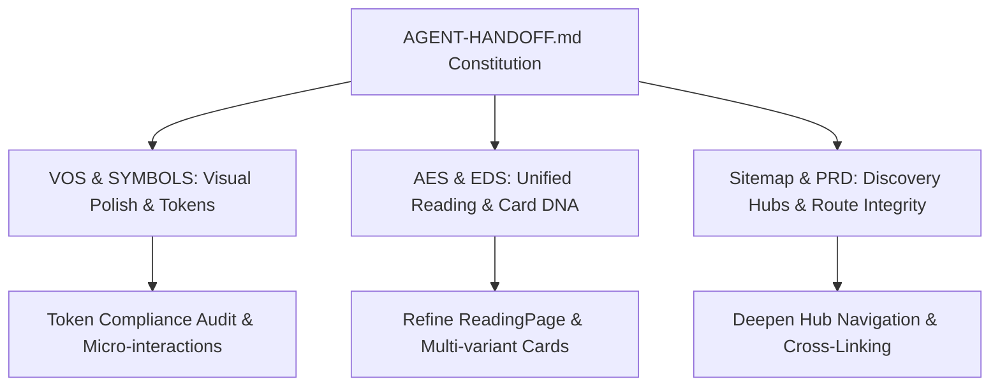

# ARCHRON Professional Web Architecture Upgrade Specification

**Date:** 2026-07-03  
**Status:** Approved Living Blueprint (Auto-Run Protocol)  
**Author:** Antigravity AI Engineering Team  
**Constitutional Reference:** `AGENT-HANDOFF.md`, `AES.md`, `EDS.md`, `PRD.md`, `SYMBOLS.md`, `Sitemap.md`, `VOS.md`

---

## 1. Executive Summary & Philosophy

ARCHRON is not a standard website or marketing blog; it is a **Timeless Human Knowledge Library** and **Visual Operating System (AVOS)**. To elevate the platform to a world-class professional academic standard, every line of code, UI component, and route must strictly adhere to our 6 Constitutional Pillars and our Master Operational Constitution (`AGENT-HANDOFF.md`).

This specification outlines the systematic architectural upgrade across all 7 strategic dimensions of ARCHRON, synthesizing our governing design and data protocols into a cohesive, high-performance web experience.

---

## 2. Synthesis of the 6 Constitutional Pillars

### 2.1 Visual Operating System (`VOS.md`)
* **Core Principle:** *Quiet Interface, Knowledge First.*
* **Upgrade Strategy:**
  * Strict adherence to night-sky astronomical palette tokens (`--color-deep-navy`, `--color-midnight`, `--color-antique-gold`).
  * Eliminate all hardcoded hex colors across frontend components and enforce fluid typography via CSS `clamp()`.
  * Ensure smooth motion using `--ease-soft` and `--dur-base` while honoring `prefers-reduced-motion`.

### 2.2 Editorial Experience System (`AES.md`)
* **Core Principle:** *Reading an Encyclopedia, Not Scrolling a Feed.*
* **Upgrade Strategy:**
  * Standardize reading page container widths to exact optimal line lengths (`760px` max for long-form prose).
  * Enforce the 10-step Reading Page Hierarchy: Breadcrumbs → Identity Block → Metadata Grid → Lead Summary → Table of Contents → Core Prose → Academic Footnotes → Knowledge Connections → Citation Box → Backlink Network.

### 2.3 Editorial DNA System (`EDS.md`)
* **Core Principle:** *Every Card Inherits from the Same Genome.*
* **Upgrade Strategy:**
  * Refactor all knowledge cards (Articles, Concepts, Schools, Thinkers) to inherit the 6-layer DNA:
    1. **Identity:** Title (TH/EN), Symbol, Type Badge, Cosmology Accent.
    2. **Context:** Thinker, School, Era, Discipline.
    3. **Relationship:** Prerequisites, Related Nodes, Bridge Colors (`--mix-*`).
    4. **Content:** Concise Lead Excerpt, Key takeaway.
    5. **Evidence:** Primary/Secondary Citation count, Academic rigor level.
    6. **Navigation:** Clear action affordance, interactive micro-states.

### 2.4 Symbol Dictionary (`SYMBOLS.md`)
* **Core Principle:** *Symbols Express Knowledge Before Decoration.*
* **Upgrade Strategy:**
  * Enforce uniform usage of the 17 Knowledge Objects across all navigation hubs, badges, and card headers.
  * Map every dynamic route type directly to its assigned semantic symbol (e.g., Open Book for Articles, Astrolabe for Constellation, Pillar for Schools).

### 2.5 Product Requirements Document (`PRD.md`)
* **Core Principle:** *Human First, Academic Rigor, Thai-First Architecture.*
* **Upgrade Strategy:**
  * Ensure full support for 3 core Personas: The Curious Reader, The Serious Scholar, and The Knowledge Contributor (Writer/Editor).
  * Maintain clear separation between verified academic facts and editorial interpretations.

### 2.6 Dynamic Route Architecture (`Sitemap.md` v3.0)
* **Core Principle:** *Invariant Knowledge Chain Ontology.*
* **Upgrade Strategy:**
  * Structure discovery hubs to support deep cross-referencing across 6 axes:
    * `/knowledge` — Primary unified directory.
    * `/constellation` — Interactive radial focus map.
    * `/themes` — Cross-disciplinary philosophical bridges.
    * `/schools` & `/thinkers` — Traditions and intellectual lineages.
    * `/search` — Semantic and faceted exploration.

---

## 3. Comprehensive Architectural Upgrade Roadmap

### Phase 1: Visual & Token Integrity (VOS & SYMBOLS)
* Audit all UI components to guarantee zero hardcoded hex values outside explicit dashboard exceptions.
* Verify material symbols and icons conform to `SYMBOLS.md` definitions across SiteHeader, PageHeaders, and Cards.

### Phase 2: Editorial & Card Standardization (AES & EDS)
* Ensure `ReadingPage` renders all metadata, citations, and bidirectional links according to `AES.md`.
* Standardize all card variants across `/articles`, `/concepts`, `/schools`, and `/thinkers` to inherit the `EDS.md` 6-layer genome.

### Phase 3: Route Discovery & Navigation Elevation (Sitemap & PRD)
* Strengthen interlinkage between `/knowledge`, `/constellation`, `/schools`, and `/search`.
* Ensure every page incorporates proper fallback states, error boundaries, and `ScrollReveal` animations.

---

## 4. Verification & Quality Assurance Protocol

1. **Automated Linting:** `npm run lint` (100% Zero Warnings/Errors).
2. **Static & Dynamic Build Audit:** `npm run build` (Clean Type & Route Generation).
3. **Unit & Integration Testing:** `npm test` via Vitest and Playwright.
4. **Token Verification:** Grep audit across `app/` and `components/` for non-compliant styling.
